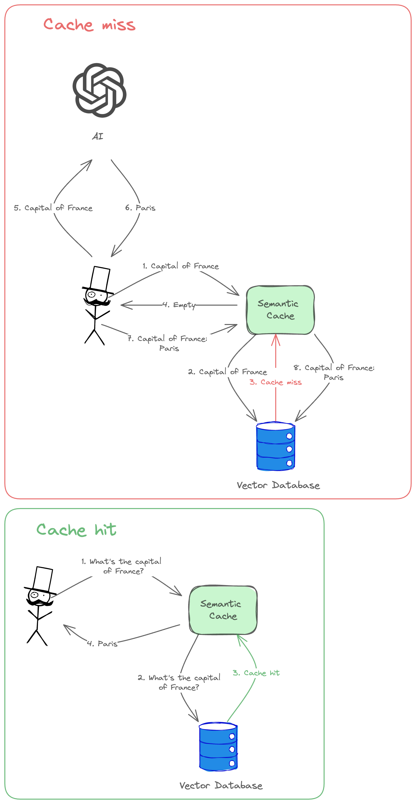

# Semantic Cache

Semantic Cache is an advanced caching solution that leverages natural language processing to store and retrieve text based on its underlying meaning, rather than just exact matches. Unlike traditional caching methods that rely solely on string equality, Semantic Cache can recognize semantic similarities between phrases or sentences, even if they are phrased differently.

For example, the phrases "great places to check out in Spain" and "best places to visit in Spain" would be considered semantically similar by Semantic Cache, despite their literal differences. This capability makes Semantic Cache highly valuable for tasks that involve natural language processing, such as text classification, information retrieval, and caching AI-generated responses.

By recognizing and capitalizing on semantic similarities, Semantic Cache can significantly improve cache hit rates and reduce redundant computations, leading to more efficient and effective systems. It empowers applications to provide more relevant and meaningful results, even when users express their queries in diverse ways.

Whether you're building a chatbot, a search engine, or any other NLP-driven application, Semantic Cache can enhance performance and user experience by intelligently caching and retrieving information based on its true meaning, rather than just surface-level textual matches.



## Key Features
* Uses semantic similarity: Stores cache entries by their meaning, not just the literal characters
* Handles synonyms: Recognizes and handles synonyms
* Multi-language support: Works across different languages (if configured with multilingual vector models)
* Easy integration: Simple API for usage in Java applications
* Customizable: Set a custom `similarityThreshold` to filter out less relevant results

The `similarityThreshold` parameter ranges from 0 to 1. It lets you define the minimum relevance score to determine a cache hit.
The higher this number, the more similar your user input must be to the cached content to be a hit.
In practice, a score of 0.95 indicates a very high similarity, while a score of 0.75 already indicates a low similarity.
For example, a value of 1.00, the highest possible, would only accept an exact match of your user query and cache content as a cache hit.

## Getting Started
### Prerequisites
* Redis database

You can run it in docker with the following command:
```bash
docker run -d -p 6379:6379 -p 8001:8001 redis/redis-stack:latest
```

### Examples
#### Using as a standalone library

* Add maven semantic-cache dependency to your project
```xml

<dependency>
    <groupId>com.hladunoleksander</groupId>
    <artifactId>semantic-cache-redis</artifactId>
    <version>${version}</version>
</dependency>
```
* Semantic cache library relies on [langchain4j](https://github.com/langchain4j/langchain4j) library under the hood to create the embeddings for the text. You need to import the corresponding embedding provider:

```xml

<dependency>
    <groupId>dev.langchain4j</groupId>
    <artifactId>langchain4j-open-ai</artifactId>
    <version>${version}</version>
</dependency>
```
* Use `SemanticCache` in your application
```java
import com.hladunoleksander.semanticcache.core.DefaultSemanticCache;
import com.hladunoleksander.semanticcache.persistence.redis.RedisVectorStore;
import com.hladunoleksander.semanticcache.persistence.redis.RedisVectorStoreProperties;
import dev.langchain4j.model.openai.OpenAiEmbeddingModel;

import java.time.Duration;

public class Main {

    public static void main(String[] args) {
        var redisVectorStoreProperties = RedisVectorStoreProperties.builder()
                .host("localhost")
                .port(6379)
                .vectorDimensionality(1536)
                .similarityThreshold(0.95)
                .build();

        var redisVectorStore = new RedisVectorStore(redisVectorStoreProperties);

        var embeddingModel = OpenAiEmbeddingModel.builder()
                .apiKey("YOUR_OPEN_AI_API_KEY")
                .modelName("text-embedding-ada-002")
                .build();

        var semanticCache = new DefaultSemanticCache(embeddingModel, redisVectorStore);

        semanticCache.set("year in which the Berlin wall fell", "1989");

        // 👇 outputs: "1989"
        semanticCache.get("what's the year the Berlin wall destroyed?")
                .ifPresentOrElse(
                        System.out::println,
                        () -> System.out.println("No answer found"));
    }
}
```
#### Using in spring boot application
* Add maven `semantic-cache-redis-spring-boot-starter` dependency to your project

```xml

<dependency>
    <groupId>com.hladunoleksander</groupId>
    <artifactId>semantic-cache-redis-spring-boot-starter</artifactId>
    <version>${version}</version>
</dependency>
```

* Add langchain4j embedding provider dependency

```xml

<dependency>
    <groupId>dev.langchain4j</groupId>
    <artifactId>langchain4j-open-ai-spring-boot-starter</artifactId>
    <version>${version}</version>
</dependency>
```
* Add the following properties to your `application.properties` file

```properties
langchain4j.open-ai.embedding-model.api-key=YOUR_OPEN_AI_API_KEY
langchain4j.open-ai.embedding-model.model-name=text-embedding-ada-002

semantic-cache.redis.host=localhost
semantic-cache.redis.port=6379
semantic-cache.redis.vector-dimensionality=1536
semantic-cache.redis.similarity-threshold=0.95
```
* Inject `SemanticCache` in your spring boot application

```java
@Bean
CommandLineRunner commandLineRunner(SemanticCache semanticCache) {
    return args -> {
        semanticCache.set("year in which the Berlin wall fell", "1989", Duration.ofSeconds(3));
        
        // 👇 outputs: "1989"
        semanticCache.get("what's the year the Berlin wall destroyed?")
                .ifPresentOrElse(
                        System.out::println,
                        () -> System.out.println("No answer found"));
    };
}
```

## Contributing
I appreciate your contributions! If you'd like to contribute to this project, please fork the repository, make your changes, and submit a pull request.

## License
Distributed under the MIT License. See `LICENSE` for more information.